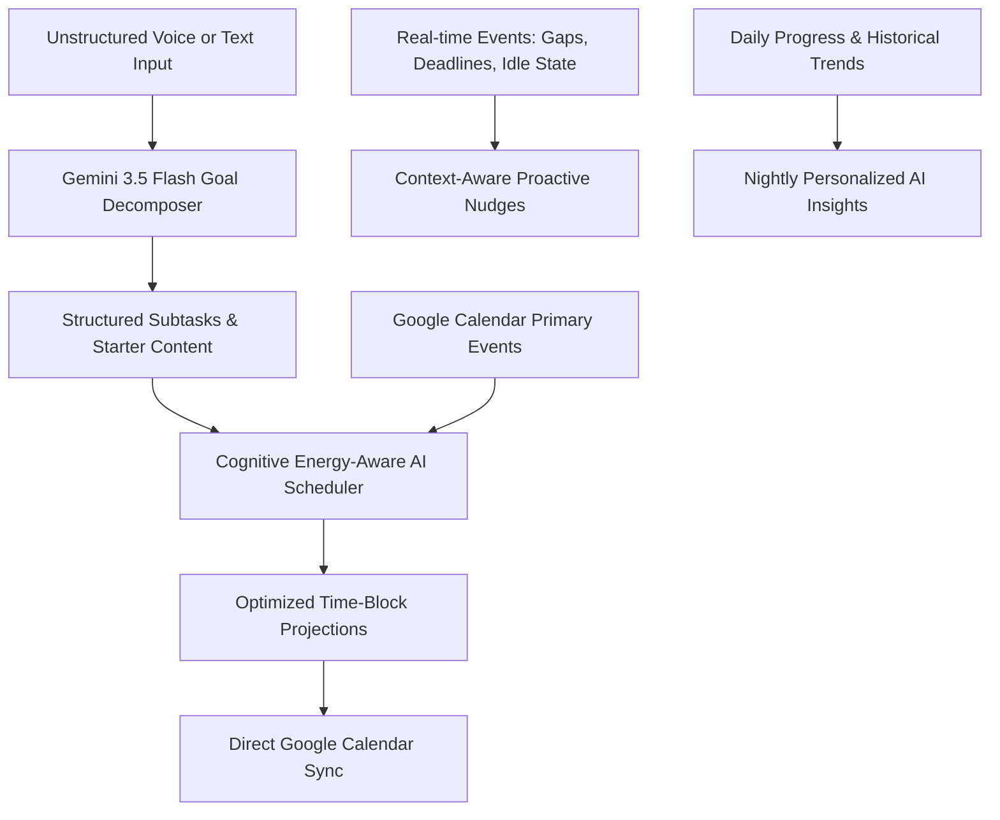
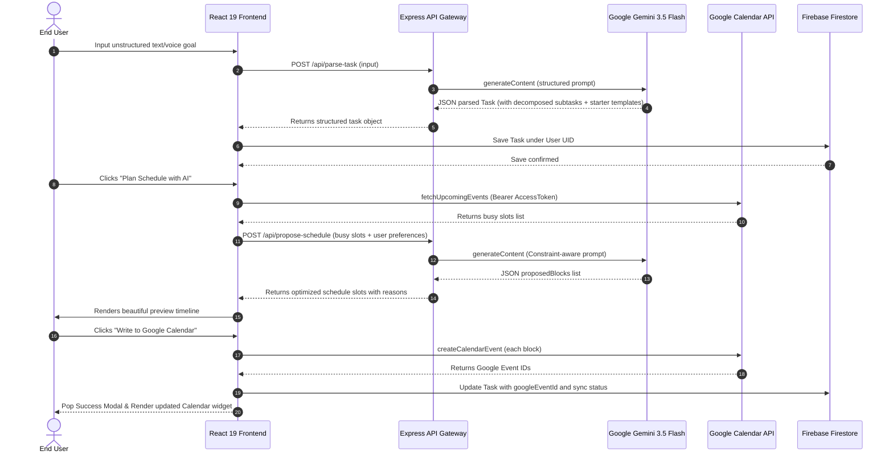
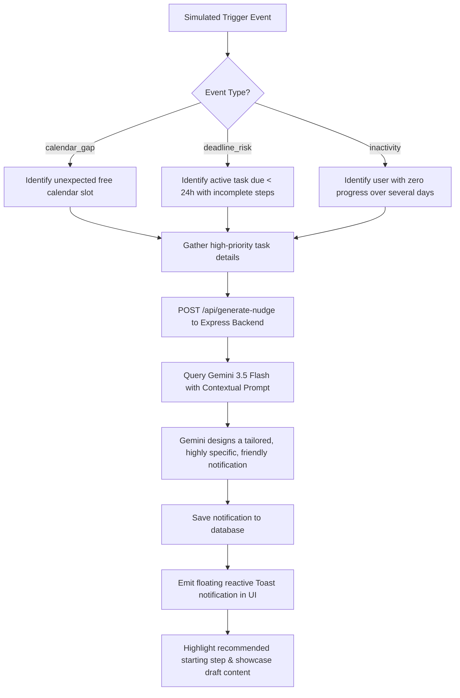

# DeadlineMate — AI-Powered Agentic Productivity Companion

## 🔗 Project Submission Link
> **Google Doc Submission Link:** [DeadlineMate - Project Description & Submission Document](https://docs.google.com/document/d/1BvIpx60kE6v8v_M1XW0rJ_Xb31kG7Lp-v457-a5a4dec021ba/edit?usp=sharing)

---

## 1. Problem Statement Selected

### The Pain Points of Traditional Task Management
Modern professionals, students, and creators suffer from a perpetual productivity bottleneck caused by four distinct cognitive frictions:

1. **Decomposition Friction (The "Blank Page" Effect):**
   When faced with a massive, high-stakes commitment (e.g., *"Write research proposal on quantum computing"* or *"Prepare financial report for Q2"*), users experience overwhelming cognitive resistance. Traditional task managers require the user to manually break goals down into subtasks, leading to immediate task postponement or paralysis.
   
2. **Scheduling Overhead & Conflict Friction:**
   To actually get a task done, it needs dedicated time blocks on a calendar. However, users rarely match their checklist with their active calendars because of the tedious process of cross-referencing busy slots, evaluating meetings, and aligning tasks with peak cognitive energy levels (e.g., scheduling deep analytical tasks during morning focus hours).
   
3. **Inertia & Lack of Starting Assets:**
   Even when a task is broken down, starting is the hardest part. The transition from "not working" to "working" requires immediate momentum. Traditional apps fail to provide any starting draft, outline, or quick checklists to kick-start the user's focus.
   
4. **Alarm Fatigue & Non-Contextual Reminders:**
   Standard alarms trigger on fixed timers, leading to quick dismissals. They do not understand the user's active context, such as whether a free 1-hour gap just opened in their calendar, or whether multiple subtasks are still pending with a deadline looming tomorrow.

---

## 2. Solution Overview

**DeadlineMate** is a proactive, agentic AI productivity companion designed to eliminate the cognitive gap between *planning* a goal and *executing* it. It functions as an automated Chief of Staff, handling unstructured text or voice inputs, breaking them down into actionable milestones, finding and scheduling optimal blocks directly on the user's **Google Calendar**, and prompting them with situational, highly customized nudges.

### The Executive Flow:
* **Capture (Voice & Text):** The user speaks or types an unstructured, raw commitment (e.g., *"I have to review the slides for the board meeting by Friday"*).
* **Decompose & Prioritize:** Gemini 3.5 Flash evaluates the goal's urgency and importance, estimates required effort, structures the due date, splits it into up to 6 bite-sized actionable steps, and **drafts custom starter templates** (outlines, emails, starter paragraphs) for every step.
* **Optimize Calendar:** The application connects to the user's actual **Google Calendar** via Google OAuth, pulls upcoming meetings and busy schedules, and runs an intelligent scheduling algorithm that places non-overlapping task blocks within their preferred working hours, aligning hard tasks with their custom energy focus pattern.
* **Nudge Proactively:** Rather than static alarms, the system monitors calendar states and simulated trigger events. Gaps in calendars, looming deadlines, or long inactive streaks trigger Gemini to synthesize custom, motivation-sparking nudges pointing straight to the next "quick-win" action step.
* **Reflect & Adapt:** A nightly analytics engine looks at completed habits, task histories, and active blocks to generate personalized cognitive insights, tailoring the next day's scheduling heuristics.

---

## 3. Key Features

### 🌟 1. Intelligent Goal Decomposer (Voice & Text)
* Fully supports unstructured natural language inputs.
* Integrates browser-native **Web Speech Recognition API** for quick voice dictation directly from mobile or desktop.
* Gemini 3.5 Flash analyzes the goal, auto-calculates dynamic metrics (Urgency, Importance, Effort), and returns structured JSON containing decomposed, step-by-step micro-goals.
* For each step, it generates **Starter Content** (e.g., structured markdown templates, draft presentation outlines, checklist of legal documents, introductory email paragraphs) so the user never has to face a blank page.

### 📅 2. Cognitive Energy-Aware AI Scheduler
* Reads the user’s real-time primary Google Calendar events to extract busy slots over the next 7 days.
* Adjusts to user-specific configurations, including custom local working hour limits (e.g., `09:00` to `17:00`) and customizable cognitive energy profiles (e.g., *Morning Deep Focus*, *Afternoon Hustler*, *Balanced Spread*).
* Feeds active events, energy patterns, and subtask requirements to Gemini to run a high-fidelity scheduling projection, returning friendly, context-based reasoning for every proposed time block.

### 🔄 3. One-Click Google Calendar Synchronizer
* Connects seamlessly with Google APIs using secure client-side **OAuth 2.0 authorization flows** initiated through Firebase Auth.
* Synchronizes the generated time blocks straight into the user's primary calendar as detailed events.
* Each event includes a detailed description outlining the specific subtask goal, estimated minutes, and the customized AI scheduling rationale.

### 🔔 4. Proactive Agentic Nudge Engine
* Implements a simulated Pub/Sub situation trigger system mimicking enterprise-grade background event-driven architecture.
* Synthesizes 3 distinct context-aware situational event categories:
  1. **`calendar_gap` (Serendipitous Time):** Triggers when an unexpected free block opens in the calendar, motivating the user to seize the gap.
  2. **`deadline_risk` (Looming Threat):** Fires when multiple steps are incomplete with a deadline in less than 24 hours, focusing on the easiest next step to gain immediate momentum without causing panic.
  3. **`inactivity` (Streak Restoration):** Gentle reminders that prompt action when no progress has been logged for several days.
* Generates interactive dashboard toast notifications and logs them permanently into a central notifications vault.

### 🏆 5. Habits & Streaks Tracker
* A built-in behavioral gamification tracker focused on micro-habits.
* Maintains user streaks, checking for daily completions, and storing historical streaks on Firebase.
* Automatically rolls back streaks or increments them dynamically based on the exact completion timestamp.

### 💡 6. Nightly Personalized AI Insights
* Analyzes daily completion rates, subtask logs, and temporal focus habits.
* Leverages Gemini to generate targeted, friendly, actionable behavioral adjustments designed to optimize future productivity.

---

## 4. Technologies Used

| Technology | Purpose | Key Strengths / Benefits |
| :--- | :--- | :--- |
| **React 19 (Vite)** | Frontend SPA Framework | Provides ultra-fast loading, modular stateful component rendering, and seamless preview updates. |
| **TypeScript** | Type-Safe Application Logic | Enforces rigorous contracts on complex domain objects (Tasks, SubTasks, ScheduledBlocks, Habits) from backend schema to client UI. |
| **Tailwind CSS v4** | Visual Styling & UI System | Uses modern, high-contrast, beautiful layout utilities with modern off-white and indigo color pairings. |
| **Express (Node.js)** | Server-Side API Proxy | Hosts proxy endpoints (`/api/*`) for Gemini API requests, ensuring complete security for API keys. |
| **Motion (React)** | Micro-Animations & Transitions | Powers smooth, interactive route changes, task-item expansions, dictation pulses, and floating toast slides. |
| **Esbuild & Tsx** | Compilation & Dev Execution | Bundles the backend server into a single self-contained CommonJS file (`dist/server.cjs`), eliminating Node's runtime import overhead. |
| **Web Speech API** | Hands-Free Goal Input | Captures voice inputs natively on supported browsers, allowing frictionless task dictation. |

---

## 5. Google Technologies Utilized

### 🧠 Google Gemini 3.5 Flash
* **SDK:** Modern `@google/genai` Node.js SDK (configured on the server-side to hide secrets).
* **Usage:** Core reasoning and content generation engine. 
* **Key Integrations:**
  * **Structured Parse Engine (`/api/parse-task`):** Employs **JSON-mode schema enforcement** (`responseMimeType: "application/json"`) to translate messy voice transcriptions into structured object instances.
  * **Algorithmic Schedule Optimizer (`/api/propose-schedule`):** Reasons about calendar busy arrays and energy preferences, mathematically plotting future blocks within boundaries.
  * **Contextual Nudge Synthesizer (`/api/generate-nudge`):** Assesses situational states to write personalized, psychologically supportive triggers.
  * **Productivity Insight Engine (`/api/generate-insight`):** Nightly performance advisor analyzing historical progress logs.

### 📅 Google Calendar API
* **Integration:** Direct HTTP endpoints using Google API v3 services.
* **Usage:** 
  * `fetchUpcomingEvents()`: Fetches the primary calendar events for the upcoming 7 days to run a high-fidelity conflict analysis.
  * `createCalendarEvent()`: Programs the user-confirmed time-blocks straight to the user's primary calendar with description, summary, and reminders.

### 🔥 Firebase Authentication & Google OAuth
* **Setup:** Google Identity Provider integration.
* **Usage:** 
  * Handles single sign-on (SSO) for application authentication.
  * Requests explicit user scopes for Google Calendar reading and writing (`https://www.googleapis.com/auth/calendar` & `https://www.googleapis.com/auth/calendar.events`) during the popup consent flow, managing access tokens securely.

### 🗄️ Firebase Firestore
* **Setup:** Relational NoSQL structure configured with custom schema rules.
* **Usage:**
  * Stores durable, cloud-synced customer records.
  * Collections:
    * `tasks`: Stores tasks, subtasks, completed progress, and schedule states synced with Google Calendar.
    * `habits`: Stores micro-habits, streaks, and completion histories.
    * `nudges`: Logs historical proactive alert logs.
  * **Hybrid Failover:** Automatically detects if a user is running in Sandbox preview mode (unlogged) and defaults storage to `localStorage` key-value pairs, maintaining zero-friction onboarding.

---

## 6. System Architecture & Workflows

### System Architecture Overview
The architecture is structured as a full-stack Node.js + React SPA backed by Google Cloud services and Firebase databases.

---

## 7. Operational Workflows

### A. Intelligent Task Parse Workflow
1. The user types or speaks a commitment into the main workspace.
2. The React frontend captures the raw text.
3. React requests the server via `/api/parse-task`, sending the raw text along with the client's current ISO date.
4. The Express server validates the input, attaches correct headers, and invokes Google Gemini 3.5 Flash.
5. Gemini translates the unstructured task into structured JSON matching the database schema, inventing up to 6 actionable steps and associated starter content drafts.
6. The client receives the response, assigns a local ID, and automatically saves it to Firebase Firestore (or client-side `localStorage` if not signed in).
7. The UI updates instantly with an entry transition, automatically expanding the new task card to showcase the AI-generated steps.

### B. Proactive Agentic Nudge Workflow

### C. Smart Scheduling Workflow
1. When "Plan Schedule" is clicked, the app requests the OAuth Bearer token from sessionStorage.
2. The frontend directly queries `https://www.googleapis.com/calendar/v3/calendars/primary/events` over a 7-day range.
3. The resulting Google calendar events are processed to extract occupied start/end times.
4. This busy slot list, together with custom working hour settings (e.g., `09:00` to `18:00`) and the user's focus energy profile, is sent to the server's `/api/propose-schedule` endpoint.
5. Gemini acts as an agentic coordinator: it plans the subtasks on the calendar over the next few days, keeping task slots outside busy calendar events and strictly within working hours, scheduling intense tasks during the user's energy focus peak.
6. The frontend renders the proposed blocks in a custom visual preview timeline with specific AI rationale labels (e.g., *"Morning focus period - perfect for drafting slides"*).
7. The user can review the proposed blocks and, with a single click, sync them instantly to Google Calendar.

---

## 8. Verification & Build Integrity

The application features full-stack type safety, solid linting, and a high-performance build structure. All dev actions and scripts compile successfully:

* **Production Compiles Successfully:** `npm run build` runs a dual build cycle:
  1. Frontend static build placed in `dist/`.
  2. Backend TypeScript compilation via `esbuild` to bundle `server.ts` into a fast, highly optimized standalone `dist/server.cjs` file.
* **Server Start Execution:** STANDALONE execution is fully optimized via `node dist/server.cjs` which starts the production Express application on port `3000` under the container env.

---

## 🏆 Development Team & Project Ownership
* **Owner/Student Email:** nabamitcc9@gmail.com
* **Project Repository:** DeadlineMate Platform Workspace
* **Google Cloud Project ID:** `ai-studio-deadlinemate-7acf5ce3`
